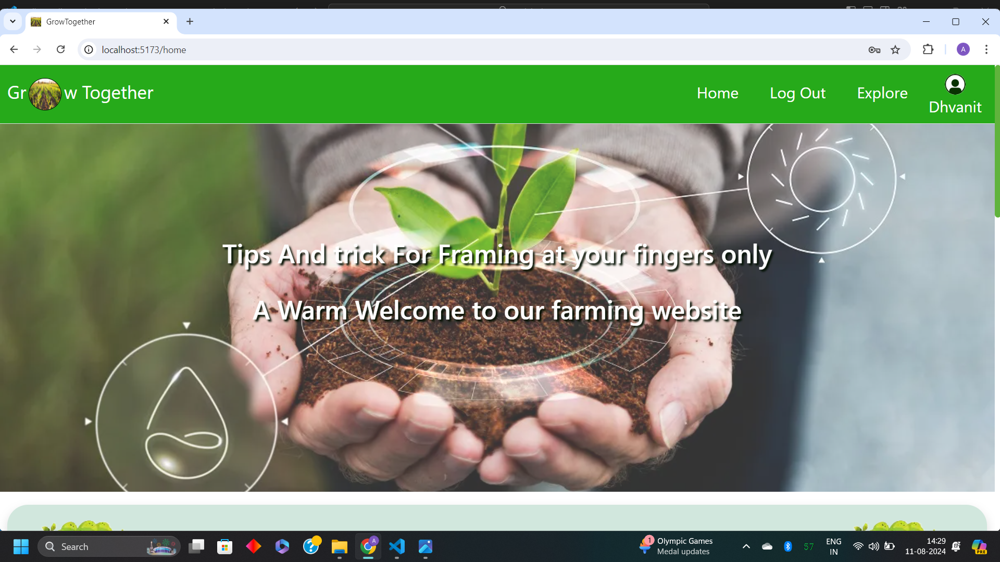
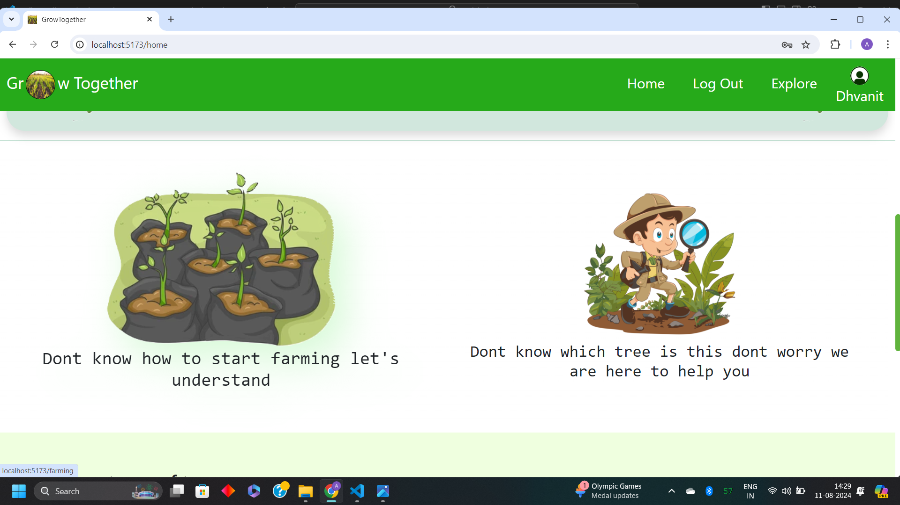
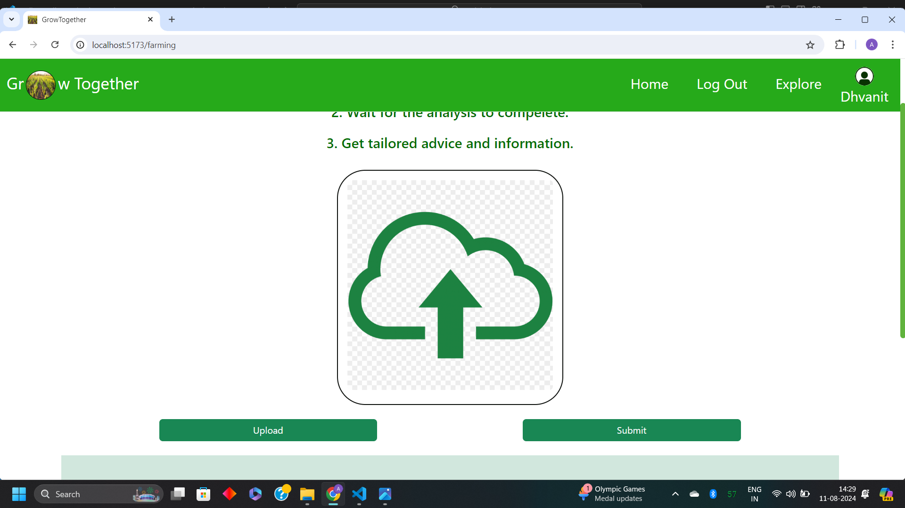
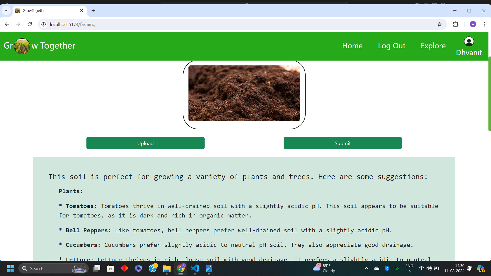
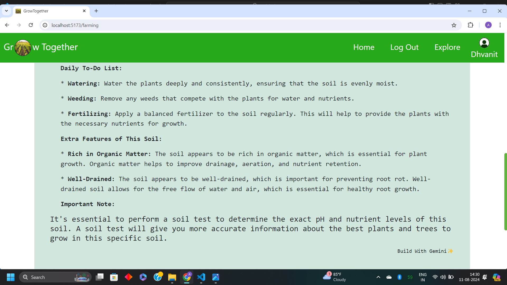

# Let's GROW TOGETHER 

### We have created a plateform that empower both farmer and other gardeners. our plateform provide mainly 2 feature
-   soil analyser : 
    -  here you have to upload an image of your soil ,our plateform provide tailored recommendation for optimal crop selection and give one to do list also 
- Tree exploring section :
   - Whether if you find some tree and you dont know which tree was that, you have curiosity to explore but dont know where to go  then don't worry we are here to help you , you just need to upload image of that tree our website provide detail information about that perticular tree .

### And it all done by Gemini API 
#### heart of our project is inside backend folder
- backend
   - Controller
     - geminians 
       - here you find the main code of our gemini api integration
       - this a heart of our project
       - a Warm thanks to gemini  

lets's see over view of our web :-

- Homepage

- Explore Section

- Here you have to upload image for analyse you soil or explore any tree

- after click on submit tailor advice generated by GEMINI is display 

